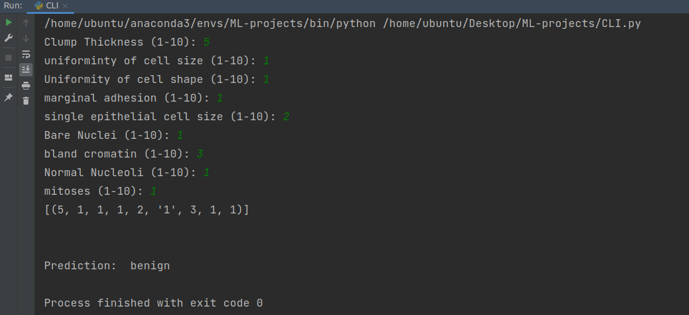
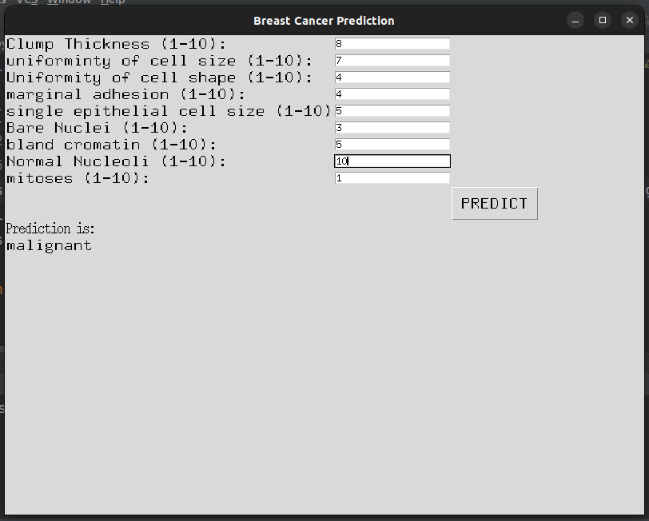

# Breast-cancer-Prediction-using-ML
Breast Cancer prediction using ML techniques  

## CLI

## GUI

## SETUP
best to create a virtualEnv (I am using Conda)  
python=3.10 || >3.7 
  
  
Virtual ENV Install anaconda create virtual env  

### `conda create --name ENV_NAME`  
  
In your 'cd' and goto file directory of where you want to code

### `conda activate ENV_NAME`  
  
Install the below listed packages using pip

### `pip install package_name` 

*PACKAGES USED:*  
pandas  
numpy  
sklearn  
matplotlib  
pickle --> to save models  
  
To deactivate environment

### `conda deactivate`

## DATASET
https://archive.ics.uci.edu/ml/datasets/Breast+Cancer+Wisconsin+%28Original%29  

## INFO
Support Vector Machine:
https://scikit-learn.org/stable/modules/svm.html#classification
